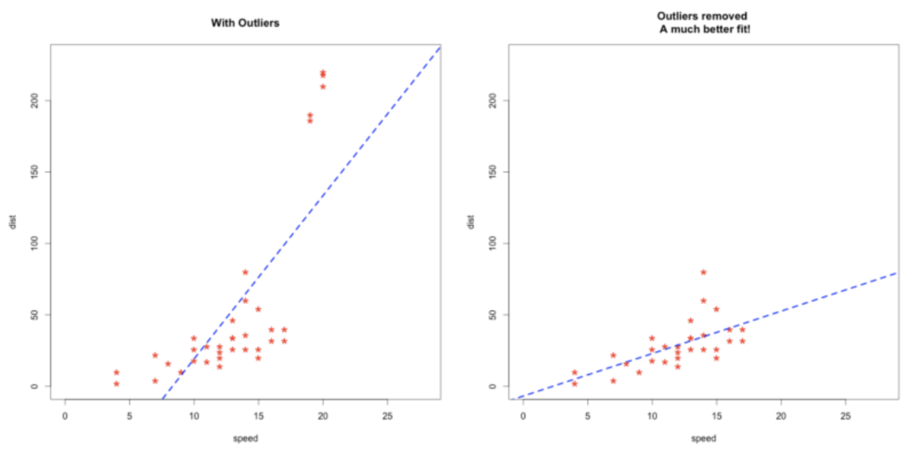
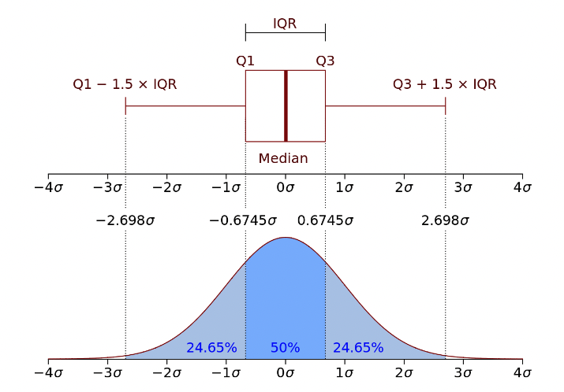
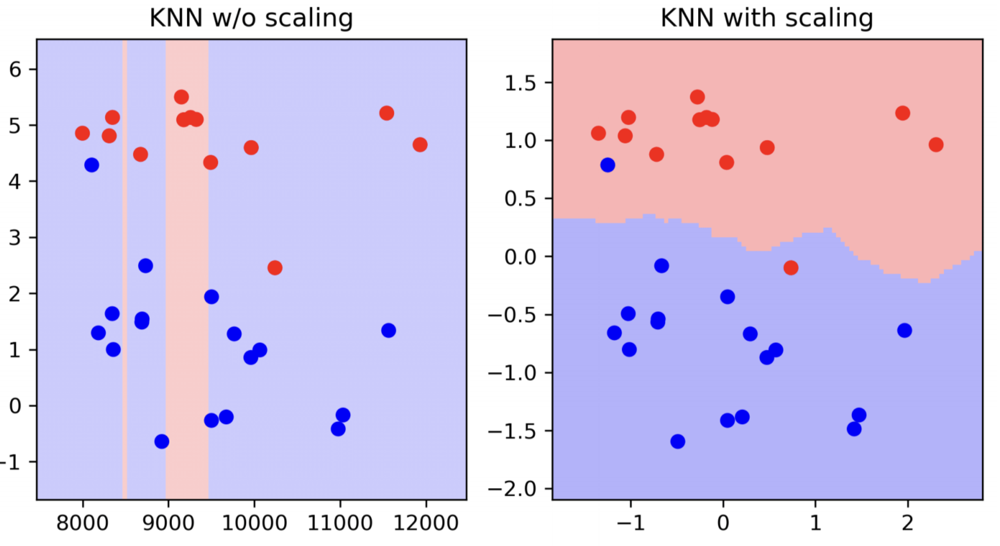
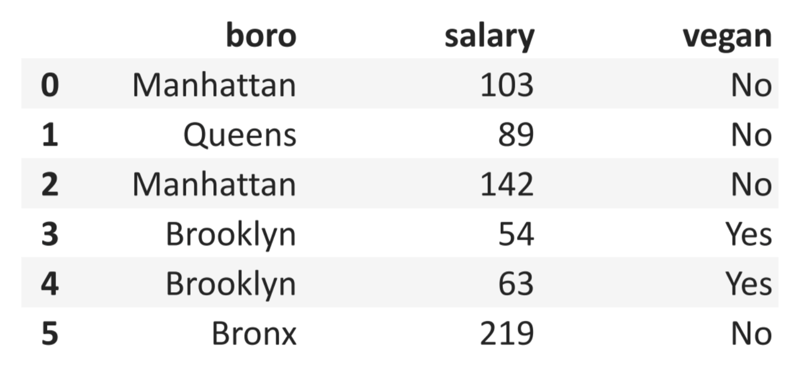
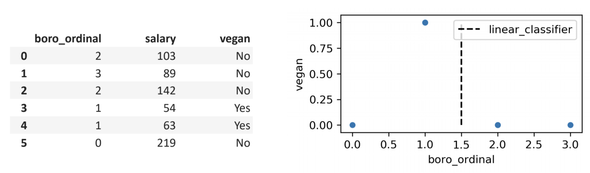
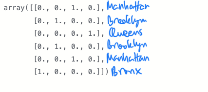
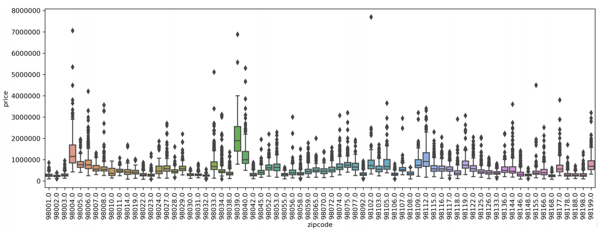
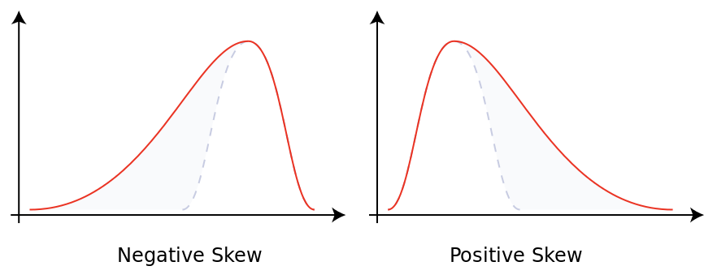

--- 
marp: true
author: 
  - name: Daniel Garcia
  - email: dgarciah@faculty.ie.edu
  - url: www.linkedin.com/in/dgarhdez
header: "ML2 - Data Cleaning"
size: 4:3
footer: "Daniel Garcia, dgarciah@faculty.ie.edu"
theme: default
math: katex
---
<!-- _class: invert -->
# Machine Learning 2

## 2. Data Cleaning

---
<!-- paginate: true -->
### About Data cleaning

*90% of data science is wrangling data, the other 10% is complaining about wrangling data*

:woman: [@evelgab](https://twitter.com/evelgab)

---

### The ML pipeline: rom raw data to deployed model

* *Data collection (Data engineering, analytics engineering)*
* **Data cleaning** :hand: 
* Feature engineering
* Model selection
* Model training
* Model evaluation
* *Model deployment*

---

### Data cleaning

:broom: Data cleaning is the process of fixing or removing incorrect, corrupted, incorrectly formatted, duplicate, or incomplete data within a dataset.

We can't just throw the raw data to our ML model, in general we need to clean it first.

This stage is crucial for the success of our model.

--- 

### Human biases and data

We, as humans, have biases. We are not perfect, and since we are the ones who create the data, we are also the ones who introduce biases in it.

We need to be aware of this and try to avoid it, in order to create meaningful and useful data for our ML models.

---

### What can be done to clean our data?

* Dealing with outliers
* Remove duplicates
* Remove/fill missing values
* Scale the data
* Encode categorical variables
* Dealing with skewness
...

---

### Outliers

Outliers are data points that are distant from other observations.

The presence of outliers is not wrong *per se* but it can affect the performance of our model.

* Some algorithms are more sensitive to outliers than others.
* Outliers can be a sign of a problem in the data collection process

We need to know what will be considered an outlier and whether to keep them or not.

---
<!-- _footer: "Source: http://r-statistics.co/Outlier-Treatment-With-R.html" -->
### Effect of outliers on regression models

Outliers can make our model prone to learning from extreme behaviors

<style>
  img[alt~="center"] {
    display: block;
    margin: 0 auto;
  }
</style>


---

### Keeping or removing outliers

Keep the outliers if they're meaningful

* If we're trying to find anomalies, outliers are important

Remove the outliers if they're not meaningful

* If we're trying to predict the average behavior, outliers are not important

---

### Removing outliers using the Z-score

Z-Score: how many standard deviations is our observation above/below the mean value of the whole variable.

Given the mean ($\mu$) and standard deviation ($\sigma$), the Z-score is calculated as:
$$ z_i = \frac{x_i - \mu}{\sigma} $$

We can define a threshold after which we consider an observation an outlier, e.g. 4 standard deviations above/beyond the mean.

---

### Removing outliers using the IQR

The interquartile range (IQR) is the difference between the 75th and 25th percentiles.

$$ IQR = P75 - P25 $$

We can use this IQR to define a threshold after which we consider an observation an outlier, e.g. 1.5 times the IQR.

---
<!-- _footer: "Source: https://ca.wikipedia.org/wiki/Amplitud_interquart%C3%ADlica" -->
### Visualizing Z-Score and IQR

<style>
  img[alt~="center"] {
    display: block;
    margin: 0 auto;
  }
</style>


---
<!-- _footer: "Source: https://pandas.pydata.org/docs/reference/api/pandas.DataFrame.duplicated.html" -->
### Duplicates in our data

Duplicated data can be a problem for our model because we are training it with the same data multiple times.

We can check for duplicates using the `duplicated()` method from `pandas`:
<br/>
```python
# keeping the last duplicates in certain columns
df.duplicated(
  subset=[column1, column2, ...],
  keep="last"
)
```

---
<!-- _footer: "Source: https://pandas.pydata.org/docs/reference/api/pandas.DataFrame.drop_duplicates.html" -->
### Removing duplicates

If we want to remove the duplicates, we can use the `drop_duplicates()` method from `pandas`:
<br/>
```python
# removing the rows with duplicates in certain columns
df.drop_duplicates(
  subset=[column1, column2, ...],
  keep="last"
)
```

---

### Missing values

Missing values are incompatible with most ML models, so we need to deal with them.

They can be caused by:

* Missing data
* Data generation problems
* Data collection problems

In `python` these values are represented as `None`.
In `pandas`, these values are represented as `NaN` (Not a Number) or `NaT` (Not a Time)

---
<!-- _footer: "Source: https://hushuli.github.io/Metabox-Blog.github.io/posts/2018-11-08-missing-value/fig1.jpg" -->

### Types of missing values

* **Missing completely at random (MCAR)**: The probability of being missing is the same for all cases.
* **Missing at random (MAR)**: The probability of being missing is the same only within groups defined by the observed data
* **Missing not at random (MNAR)**: The probability of being missing varies.

<style>
  img[alt~="center"] {
    display: block;
    margin: 0 auto;
  }
</style>


---
<!-- _footer: "Source: https://argoshare.is.ed.ac.uk/healthyr_book/chap11-h1.html" -->
### What to do with each type of missing values?

* **MCAR**: 
  * Remove the rows with missing values
  * Fill them with the mean/median/mode of the variable.
  * Interpolate if the variable is a time series
  * Train a model to predict the missing values

* **MNAR** / **MAR**: 
  * Impute the missing values using a model trained to predict the missing values
  * Train a model to predict the missing values

---

### Scaling the data

Having different scales for our features can affect the performance of our model, especially if we're using distance-based models.

* Feature 1: -1 - 6
* Feature 2: 8k - 12k

<style>
  img[alt~="center"] {
    display: block;
    margin: 0 auto;
  }
</style>



---

### Effect of scaling on distance-based models

The scale of the features will affect the distance.
<br>
$$ d = \sqrt{(x_1 - x_2)^2 + (y_1 - y_2)^2} $$
$$ x >> y \implies d \approx x $$
<br>
Examples of distance based algorithms: kNN, Linear Regression, Logistic Regression, SVM, etc.

---
<!-- _footer: "Source: https://scikit-learn.org/stable/auto_examples/preprocessing/plot_all_scaling.html#sphx-glr-auto-examples-preprocessing-plot-all-scaling-py" -->
### Scaling the data with `sklearn` (1/2)

`sklearn` contains several methods for scaling the data.

* [`StandardScaler`](https://scikit-learn.org/stable/modules/generated/sklearn.preprocessing.StandardScaler.html): removes the mean and scaling to unit variance (Z-score)
$$ x_{scaled} = \frac{x - \mu}{\sigma} $$
* [`MinMaxScaler`](https://scikit-learn.org/stable/modules/generated/sklearn.preprocessing.MinMaxScaler.html#sklearn.preprocessing.MinMaxScaler): scales and translates each feature individually such that it is in the given range on the training set
$$ x_{scaled} = \frac{x - x_{min}}{x_{max} - x_{min}} $$


---
<!-- _footer: "Source: https://scikit-learn.org/stable/auto_examples/preprocessing/plot_all_scaling.html#sphx-glr-auto-examples-preprocessing-plot-all-scaling-py" -->
### Scaling the data with `sklearn` (2/2)

* [`RobustScaler`](https://scikit-learn.org/stable/modules/generated/sklearn.preprocessing.RobustScaler.html#sklearn.preprocessing.RobustScaler): removes the median and scales the data according to the quantile range (good for outliers)

* [`PowerTransformer`](https://scikit-learn.org/stable/modules/generated/sklearn.preprocessing.PowerTransformer.html#sklearn.preprocessing.PowerTransformer): applies a power transformation to each feature to make the data more Gaussian-like

* [And many more...](https://scikit-learn.org/stable/modules/classes.html#module-sklearn.preprocessing)

[More info on scaling, from `sklearn`](https://scikit-learn.org/stable/modules/preprocessing.html#standardizat)

---

### Dealing with categorical variables

Most ML algorithms can't deal with categorical variables, when they come as strings. We need to encode this categories as numbers

* Sex: male/female -> 0/1
* Color: red/blue/green -> 0/1/2
* Category: SPAM/Not SPAM -> 0/1

Some algorithms can deal with categorical variables:

* Tree-based algorithms
* Some Naive Bayes algorithms

---

### Encoding categorical variables with `sklearn`

`sklearn` contains several methods for encoding categorical variables.

* [`OrdinalEncoder`](https://scikit-learn.org/stable/modules/generated/sklearn.preprocessing.OrdinalEncoder.html#sklearn.preprocessing.OrdinalEncoder): encodes the labels with an ordinal representation
* [`OneHotEncoder`](https://scikit-learn.org/stable/modules/generated/sklearn.preprocessing.OneHotEncoder.html#sklearn.preprocessing.OneHotEncoder): encodes the labels with a one-hot representation
* [`TargetEncoder`](https://contrib.scikit-learn.org/category_encoders/targetencoder.html): encodes the labels with the mean of the target for each value of the feature

* [`LabelEncoder`](https://scikit-learn.org/stable/modules/generated/sklearn.preprocessing.LabelEncoder.html#sklearn.preprocessing.LabelEncoder): encodes the labels for `y` with value between `0` and `n_classes - 1`

---

### Dataset to encode

<style>
  img[alt~="center"] {
    display: block;
    margin: 0 auto;
  }
</style>



---

### `OrdinalEncoder`

```python
df["boro_ordinal"] = OrdinalEncoder().fit_transform(df[["boro"]])
```

<style>
  img[alt~="center"] {
    display: block;
    margin: 0 auto;
  }
</style>



---

### `OneHotEncoder`

```python
import pandas as pd
from sklearn.preprocessing import OneHotEncoder

df = pd.DataFrame({
    "boro": ["Manhattan", "Brooklyn", "Queens", "Brooklyn", "Manhattan", "Bronx"]
})

ohe = OneHotEncoder(handle_unknown='ignore')
enc = ohe.fit(df)
enc.transform(df).toarray()
```

<style>
  img[alt~="center"] {
    display: block;
    margin: 0 auto;
  }
</style>



--- 

### `TargetEncoder` (1/2)

For features with LOTS of categories, this can be a good option, like the zipcode in the picture.

`TargetEncoder` encodes the labels with the mean of the target for each value of the feature.

<style>
  img[alt~="center"] {
    display: block;
    margin: 0 auto;
  }
</style>



---

### `TargetEncoder` (2/2)

<br>

```python
# initialize the encoder, specifying the column to encode
te = TargetEncoder(cols="zipcode")

# fit the encoder to the data
te.fit(
    X_train,
    y_train
)

# transform the data
te.transform(X_train)
```

---
<!-- _footer: "Source: https://en.wikipedia.org/wiki/Skewness" -->
### Skewness

Skewness is a measure of the asymmetry of the probability distribution of a real-valued random variable about its mean.

<style>
  img[alt~="center"] {
    display: block;
    margin: 0 auto;
  }
</style>



Some algorithms *assume* that the data is normally distributed. If the data is not normally distributed, the algorithm will not work as expected.

---

### Dealing with skewness

* Log transformation: $x_{log} = log(x)$

```python
df["log_price"] = np.log(df["price"])
```

* Square root transformation: $x_{sqrt} = \sqrt{x}$

```python
df["sqrt_price"] = np.sqrt(df["price"])
```

* Box-Cox transformation:
$$
x_{BoxCox} =   \left\{
\begin{array}{ll}
      \frac{x^{\lambda} - 1}{\lambda} & \lambda \ne 0 \\
      log(x) & \lambda = 0 \\
\end{array}
\right.
$$

```python
from scipy import stats
df["boxcox_price"], lmbda = stats.boxcox(df["price"])[0] 
```

---

### Reversing the transformation

We need to reverse the transformation to get the original values after making predictions.

```python
# reversing log transformations
df["price"] = np.exp(df["log_price"])

# reversing square root transformations
df["price"] = df["sqrt_price"] ** 2

# reversing box-cox transformations
df["price"] = stats.inv_boxcox(df["boxcox_price"], lmbda)
```

---

### Take home points

* Data cleaning is a mandatory, time-consuming, iterative process
* Data cleaning represents a large part of ML projects
* By understanding the data, we can make better decisions in the next steps
* Document your data cleaning process so you can reproduce it later

---
