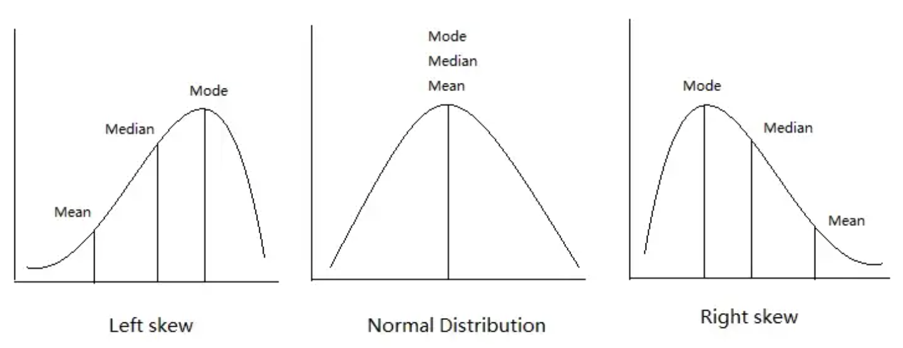
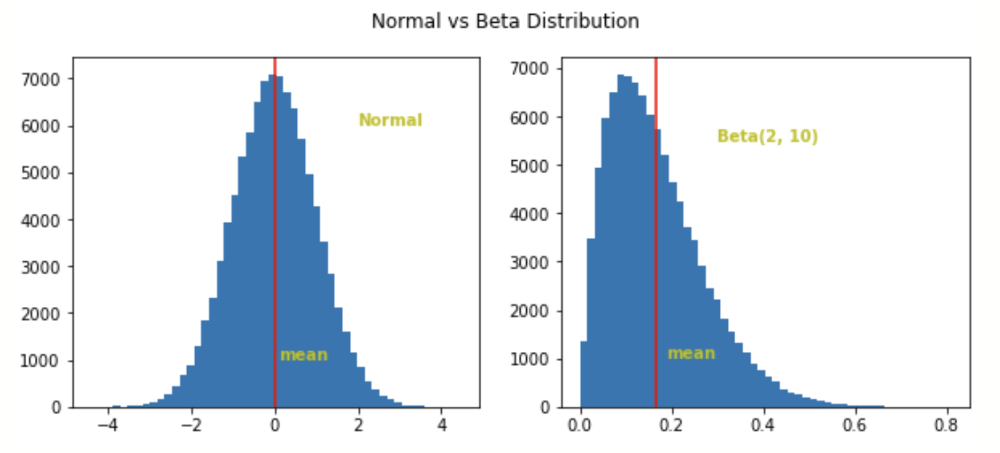
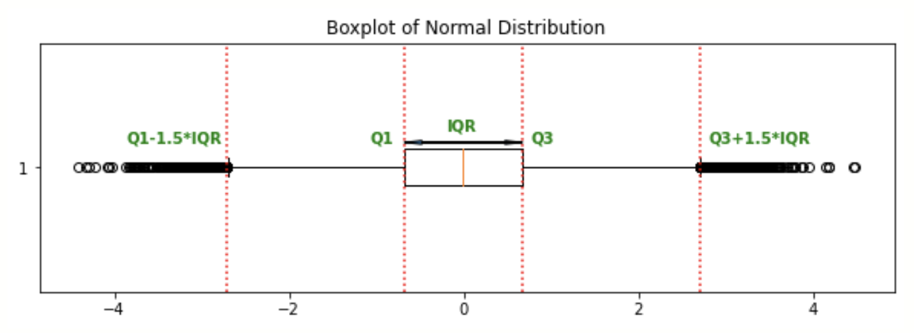

--- 
marp: true
author: 
  - name: Daniel Garcia
  - email: dgarciah@faculty.ie.edu
  - url: www.linkedin.com/in/dgarhdez
header: "ML2 - Evaluation Methods"
size: 4:3
footer: "Daniel Garcia, dgarciah@faculty.ie.edu"
theme: default
math: katex
style: |
    img[alt~="center"] {
      display: block;
      margin: 0 auto;
    }
---
<!-- _color: "rgb(31,56,94)" -->
<!-- _header:  -->
# Machine Learning 2

## Evaluation Methods

---
<!-- paginate: true -->
## Introduction to Evaluation Methods

So far we have learned how to represent our reality with a suitable algorithm, and how to train it to fit our data. But how do we know if our model is good enough?

* Model evaluation: measuring the performance of a model from a Data Scientist's point of view, and how that translates into business value.

* Model validation: measuring how sure are we that the model will work once deployed in production, with new, unseen data.

---

## Different evaluation methods for different problems

In this course we will focus on supervised learning, therefore we will learn evaluation methods for both regression and classification problems:

* Regression problems: the target variable is a continuous variable.
* Classification problems: the target variable is a categorical variable.

---

### Classification problems

This is the type of problem in which we want to predict a target that is a categorical variable:

:envelope: **Spam detection:** is this email spam or not?
:runner: **Customer churn:** will this customer leave the company or not?

In this problems we need to correctly assign labels (within two or more options) to each observation.

* 2 labels: binary classification
* 3 or more labels: multi-class classification
* We can always convert a multi-class into binary

---

### Regression problems

This is the type of problem in which we want to predict a target that is a continuous variable:

:chart_with_upwards_trend: **Stock price prediction:** what will be the price of this stock tomorrow?
:house: **House price prediction:** how much will this house cost?

In this situations, we need to predict a continuous value for each observation.

---

### No-target problems (Unsupervised learning)

There is no target variable in this type of problems, and we are interested in finding patterns in the data.

:bar_chart: **Market segmentation:** what are the different groups of customers?
:mag: **Anomaly detection:** is this transaction normal or not?


---

### Evaluation methods for Classification (1)

:one: **Confusion matrix:** a table that describes the performance of a classification model on a set of test data for which the true values are known.


We can derive different metrics from the confusion matrix.

<!-- _footer: "Source: https://en.wikipedia.org/wiki/Confusion_matrix" -->

---

### Evaluation methods for Classification (2)

:two: **Accuracy:** the fraction of predictions our model got right (from :one:)

$$ \text{Accuracy} = \frac{\text{TP + TN}}{\text{TP + TN + FP + FN}} $$

Accuracy is the most used and intuitive metric, but it is not always the best one -- for example when the classes are imbalanced.

---

### Classification metrics (3)

:three: **Precision:** the fraction of positive predictions that were correct (from :one:)

$$ \text{Precision} = \frac{\text{TP}}{\text{TP + FP}} $$

:four: **Recall:** the fraction of positive cases that were correctly identified (from :one:)

$$ \text{Recall} = \frac{\text{TP}}{\text{TP + FN}} $$

---

### Precision and Recall trade-off

We can't have both high precision and high recall at the same time.

This is because increasing precision reduces recall, and viceversa.


<!-- _footer: "Source: https://commons.wikimedia.org/wiki/File:Precision-Recall_tradeoff.png" -->

---

## Conditional Probability (1)

Conditional probability is the probability of an event given that another event has already occurred. 

It helps us understanding the outcome of an experiment based on **partial information**

$$ P(A|B) = \frac{P(A \cap B)}{P(B)} $$

Given that $P(B)\neq0$. It is read as "the probability of A given B".

---

## Conditional Probability (2): 

### Total Probability Theorem

Let $A_1, ..., A_n$ be disjoint events and $P(A_i) > 0$ for all $i$. 

$$ P(B) = \sum_{i=1}^{n} P(A_i \cap B) = \sum_{i=1}^{n} P(A_i)P(B|A_i) $$

This gives us a useful tool to calculate the probability of an event using a "divide and conquer" approach, by breaking down the problem into smaller problems that we can solve.

---

## Bayes Rule

Bayes Rule is a special case of the Total Probability Theorem:

$$ P(A|B) = \frac{P(A)P(B|A)}{P(B)} $$

* $P(A|B)$: the conditional probability of A given B (Posterior probability)
* $P(A)$: the probability of A (Prior probability)
* $P(B|A)$: the conditional probability of B given A (Likelihood)
* $P(B)$: the probability of B (Marginal probability)

---

## Basic Statistics

* Estimates of location
* Estimates of dispersion
* Covariance and correlation
* Understanding distributions
* Sampling and bootstrapping

---

### Estimates of location (1)

**Mean:** the average value of a set of data.
$$ \bar{x} = \frac{1}{n} \sum_{i=1}^{n} x_i $$

```python
np.mean([1, 2, 3, 4, 5])
>> 3.0
```

**Median:** the middle value of a ordered set of data. It is the value that divides the data into two equal parts of 50% each.

```python
np.median([1, 2, 3, 4, 5])
>> 3.0
```

---

### Estimates of location (2)

**Mode:** the most frequent value of a set of data.

```python
from scipy import stats
stats.mode([1, 1, 2, 3])
>> ModeResult(mode=array([1]), count=array([2]))
```

Depending on the distribution of the data, the mean, median, and mode can be very different.



<!-- _footer: "Source: https://medium.com/@nhan.tran/mean-median-an-mode-in-statistics-3359d3774b0b" -->

---

### Estimates of dispersion (1)

* Range: the difference between the maximum and minimum values of a set of data.

* Variance: the average squared deviation from the mean.
$$ \sigma^2 = \frac{1}{n} \sum_{i=1}^{n} (x_i - \bar{x})^2 $$

* Standard deviation: the square root of the variance.
$$ \sigma = \sqrt{\frac{1}{n} \sum_{i=1}^{n} (x_i - \bar{x})^2} $$

---

### Estimates of dispersion (2)

**Quartiles:** the values that divide the data into four equal parts of 25% each.

```python
np.percentile([1, 2, 3, 4, 5], [25, 50, 75])
>> array([2., 3., 4.])
```

**Percentiles:** The value such that P percent of the values take on this value or less and (100–P) percent take on this value or more.

* If P = 50, the value is the median.
* If normalized, the value is the quantile.

```python
np.percentile([1, 2, 3, 4, 5], 50)
>> 3.0
```

---

### Estimates of dispersion (3)

* Interquartile range: the difference between the 75th and 25th percentiles.
$$ IQR = Q_3 - Q_1 $$

* Coefficient of variation: the ratio between the standard deviation and the mean.
$$ CV = \frac{\sigma}{\bar{x}} $$

---

### Estimates of dispersion (4)

* Skewness: a measure of the asymmetry of a distribution.
$$ S = \frac{E[(X - \mu)^3]}{\sigma^3} $$

* Kurtosis: a measure of the "peakedness" of a distribution.
$$ K = \frac{E[(X - \mu)^4]}{\sigma^4} $$

---

### Covariance and correlation

* Covariance: a measure of the linear relationship between two variables.
$$ Cov(X, Y) = \frac{1}{n} \sum_{i=1}^{n} (x_i - \bar{x})(y_i - \bar{y}) $$

* Correlation: a normalized version of the covariance.
$$ Corr(X, Y) = \frac{Cov(X, Y)}{\sigma_x \sigma_y} = \frac{\frac{1}{n} \sum_{i=1}^{n} (x_i - \bar{x})(y_i - \bar{y})}{\sqrt{\frac{1}{n} \sum_{i=1}^{n} (x_i - \bar{x})^2} \sqrt{\frac{1}{n} \sum_{i=1}^{n} (y_i - \bar{y})^2}} $$

---

### Understanding distributions

With the previous concepts, we have calculated metrics that describe the data. However, in order to fully understand the data, we need to understand the distribution of the data. 

A very intuitive way to do this is to use a histogram.

A histogram is a graphical representation of the distribution of data. It is a bar graph that shows the frequency of each value in a set of data.

---

### Histograms

We can use histograms to understand the distribution of the data.

* We can see how symmetric/skewed the data is
* Alongside the mean, median, and mode, we can see how the data is distributed



---

### Boxplots

Boxplots are another way to visualize the distribution of the data. They provide information about the median, quartiles.

Also, upon selecting a threshold, we can see the outliers 
$$ outlier = \begin{cases} x < Q_1 - 1.5\cdot IQR \\ x > Q_3 + 1.5\cdot IQR \end{cases} $$



---

### Sampling and bootstrapping

* Sampling: taking a subset of a population
* Bootstrapping: a method for estimating statistics on a population by sampling with replacement
  * Bootstrapping is used in many machine learning algorithms (Random Forest)
  * We can train an independent estimator on each sample and then average the results

---
