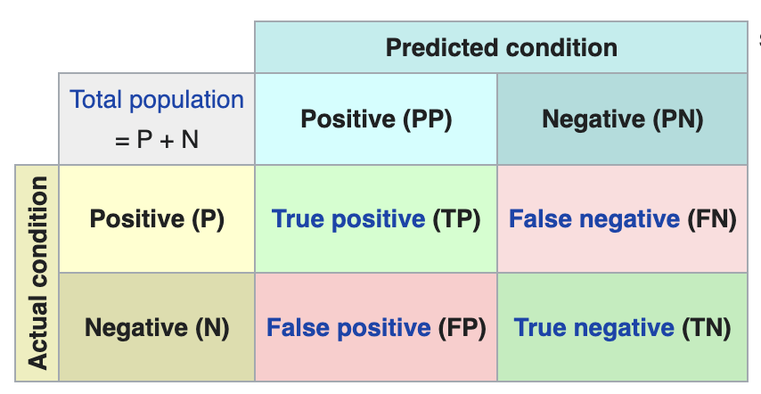
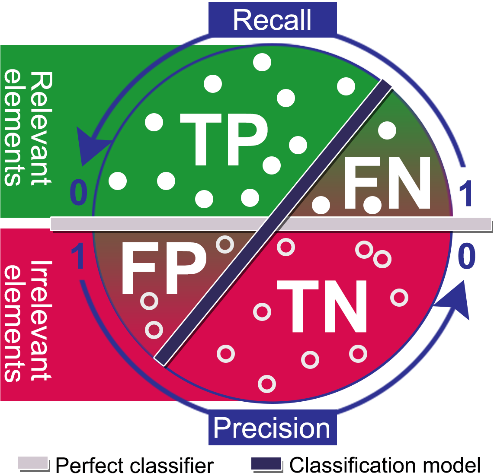

--- 
marp: true
author: 
  - name: Daniel Garcia
  - email: dgarciah@faculty.ie.edu
  - url: www.linkedin.com/in/dgarhdez
header: "ML2 - Evaluation Methods"
size: 4:3
footer: "Daniel Garcia, dgarciah@faculty.ie.edu"
theme: default
math: katex
style: |
    img[alt~="center"] {
      display: block;
      margin: 0 auto;
    }
---
<!-- _color: "rgb(31,56,94)" -->
<!-- _header:  -->
# Machine Learning 2

## Evaluation Methods

---
<!-- paginate: true -->
## Introduction to Evaluation Methods

So far we have learned how to represent our reality with a suitable algorithm, and how to train it to fit our data. But how do we know if our model is good enough?

* Model evaluation: measuring the performance of a model from a Data Scientist's point of view, and how that translates into business value.

* Model validation: measuring how sure are we that the model will work once deployed in production, with new, unseen data.

---

## Different evaluation methods for different problems

In this course we will focus on supervised learning, therefore we will learn evaluation methods for both regression and classification problems:

* Regression problems: the target variable is a continuous variable.
* Classification problems: the target variable is a categorical variable.

---

### Classification problems

This is the type of problem in which we want to predict a target that is a categorical variable:

:envelope: **Spam detection:** is this email spam or not?
:runner: **Customer churn:** will this customer leave the company or not?

In this problems we need to correctly assign labels (within two or more options) to each observation.

* 2 labels: binary classification
* 3 or more labels: multi-class classification
* We can always convert a multi-class into binary

---

### Regression problems

This is the type of problem in which we want to predict a target that is a continuous variable:

:chart_with_upwards_trend: **Stock price prediction:** what will be the price of this stock tomorrow?
:house: **House price prediction:** how much will this house cost?

In this situations, we need to predict a continuous value for each observation.

---

### No-target problems (Unsupervised learning)

There is no target variable in this type of problems, and we are interested in finding patterns in the data.

:bar_chart: **Market segmentation:** what are the different groups of customers?
:mag: **Anomaly detection:** is this transaction normal or not?

---

### Evaluation methods for Classification (1)

:one: **Confusion matrix:** a table that describes the performance of a classification model on a set of test data for which the true values are known.

We can derive different metrics from the confusion matrix.

<!-- _footer: "Source: https://en.wikipedia.org/wiki/Confusion_matrix" -->

---

### Evaluation methods for Classification (2)

:two: **Accuracy:** the fraction of predictions our model got right (from :one:)

$$ \text{Accuracy} = \frac{\text{TP + TN}}{\text{TP + TN + FP + FN}} $$

Accuracy is the most used and intuitive metric, but it is not always the best one -- for example when the classes are imbalanced.

---

### Classification metrics (3)

:three: **Precision:** the fraction of positive predictions that were correct (from :one:)

$$ \text{Precision} = \frac{\text{TP}}{\text{TP + FP}} $$

:four: **Recall:** the fraction of positive cases that were correctly identified (from :one:)

$$ \text{Recall} = \frac{\text{TP}}{\text{TP + FN}} $$

---

### Precision and Recall trade-off

We can't have both high precision and high recall at the same time.

This is because increasing precision reduces recall, and viceversa.

<!-- _footer: "Source: https://commons.wikimedia.org/wiki/File:Precision-Recall_tradeoff.png" -->

---
