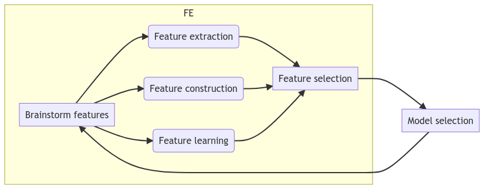

--- 
marp: true
author: 
  - name: Daniel Garcia
  - email: dgarciah@faculty.ie.edu
  - url: www.linkedin.com/in/dgarhdez
header: "ML2 - Feature Engineering"
size: 4:3
footer: "Daniel Garcia, dgarciah@faculty.ie.edu"
theme: default
math: katex
---
<!-- _color: "rgb(31,56,94)" -->
<!-- _header:  -->
# Machine Learning 2

## 3. Feature Engineering

---
<!-- paginate: true  -->
### The ML pipeline: rom raw data to deployed model

* Data collection
* Data cleaning
* **Feature engineering** :hand: 
* Model selection
* Model training
* Model evaluation
* Model deployment

---

### What is a feature?

A feature is an attribute of the data that is used to train the model. In tabular data, a feature is a column.

* Also called predictor, (independent) variable, regressor, covariate, etc.

Features are informative, discriminative, and independent.

They represent an individual measurable property or characteristic of a phenomenon being observed.

---

### From raw data to features

Not all data is ready to be used to train a model. We need to transform it into features. 

$$ \text{Raw data} \rightarrow \text{Features} \rightarrow \text{Train model} $$

We need to extract as much information as possible from the data and transform it into new features, that represent the underlying challenge in a way that is understandable by the model.

---

### The importance of feature engineering

*Coming up with features is difficult, time-consuming, requires expert knowledge. 'Applied Machine Learning' is basically feature engineering.*

:man: Andrew Ng

FE allows to create simpler models and more flexible

* Easier to deploy, maintain and explain
* Better performance than complex models with raw data

---

### FE is an iterative process

 

---
<!-- _footer: "Source: https://deepai.org/machine-learning-glossary-and-terms/feature-extraction" -->
### Feature extraction

Reducing the amount of data while maintaining the most important information.

Very useful when you need to reduce the number of resources needed for processing without losing important or relevant information. Feature extraction can also reduce the amount of redundant data for a given analysis.

* :chart_with_downwards_trend: Using PCA to reduce the dimensionality of a dataset while keeping the most important information.

---

### Feature construction

Creating new features from existing ones.

* Derived variables:
  * Ratios: `ad_spend / sales`
  * Time differences: differences, lags, etc.
  * Aggregations: `sum`, `mean`, `max`, `min`, etc.
* Dummy variables:
  * One-hot encoding
  * Binary encoding: `is_weekend`, `is_holiday`, `is_na`
* Variable transformations:
  * Scaling, log, etc.

---

### Feature Learning

This technique is used to extract features from raw data. It is a supervised learning technique, in which the target variable is the feature itself.

Once the model is trained, we can create new features to be used in our final model.

This technique is not a replacement of the manual feature engineering, but it can be used to create new features.

---

### Feature selection

Once we have created a set of features, we need to select the most relevant ones to train the model.

This process will not only reduce the dimensionality of the dataset, but it will also improve the performance of the model.

There are different techniques to perform feature selection:

* Filter methods
* Wrapper methods
* Embedded methods (Lasso, Ridge, etc.)

---

### Filter methods

:mag: Estimating the usefulness of a feature by using a ranking metric (score)

* Higher ranks are kept, lower ranks are ignored.
* The rank itself is useful to create new features.

Some algorithms provide a feature importance score internally, and we can use it to select the most relevant features.

**Methods**: correlation, chi-squared, information gain, etc.

---
<!-- _footer: "Source: https://en.wikipedia.org/wiki/Pearson_correlation_coefficient" -->
### Correlation

Correlation is a statistical measure that indicates the extent to which two or more variables fluctuate together.

$$ \rho_{x, y} = \frac{cov(x, y)}{\sigma_{x}\sigma_{y}} = \frac{\sum_{i=1}^{n} (x_i - \bar{x})(y_i - \bar{y})}{\sqrt{\sum_{i=1}^{n} (x_i - \bar{x})^2 \sum_{i=1}^{n} (y_i - \bar{y})^2}} $$

---
<!-- _footer: "Source: https://ca.wikipedia.org/wiki/Amplitud_interquart%C3%ADlica" -->
### Chi-squared test (1/2)

Used to test the independence of two events. Given the data of two variables, we can get observed count $O_i$ and expected count $E_i$. It measures how expected count E and observed count O deviates each other.

$$ 
\chi^2 = \sum_{i=1}^{n} \frac{(O_i - E_i)^2}{E_i} 
$$

In feature selection, we use chi-squared test to find out the features that are most dependent on the target variable.

The higher the Chi-Square value the feature is more dependent on the response and it can be selected for model training!

---

### Example: Chi-squared test for feature selection

---