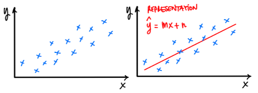
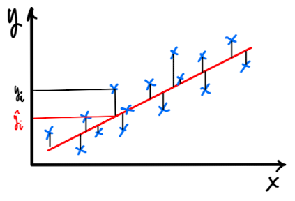
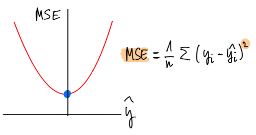
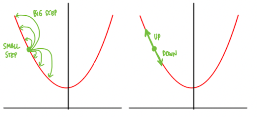
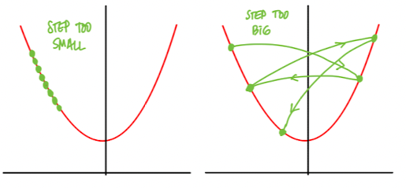

--- 
marp: true
author: 
  - name: Daniel Garcia
  - email: dgarciah@faculty.ie.edu
  - url: www.linkedin.com/in/dgarhdez
header: "ML2 - Math for ML"
size: 4:3
footer: "Daniel Garcia, dgarciah@faculty.ie.edu"
theme: default
math: katex
---
<!-- _class: invert -->
# Machine Learning 2

## Basic mathematics for Machine Learning

---
<!-- paginate: true -->
### Relation between ML and mathematics

ML mixes mathematics, statistics, and computer science to solve problems.

Without at least a basic understanding of mathematics, it is difficult to understand ML.

We will cover the basic mathematics needed: Linear Algebra and Calculus.

---
<!-- _footer: "Source: Intro to ML (Slides)" -->
### Breaking down the Learning process

$$ \text{Learning} = \text{Representation} + \text{Evaluation} + \text{Optimization}$$ 

* Representation: choosing a set of estimators (e.g. linear regression, decision trees, neural networks, etc.) to model the data.
* Evaluation: how to distinguish good from bad estimators
* Optimization: making sure the estimator is learning and improving the evaluation metric

---

### Representation

We want to find a function ($\^{y}$) that maps the input ($x$) to the output ($y$).

It looks like we can use a linear function to model the data

$$ \^{y} = mx + n $$

where $m$ is the slope and $n$ the intercept.

---

### Evaluation (1)

Now that we have a representation ($\^{y}$) we need a way to evaluate how well it represents the data.

We can use the Mean Squared Error (MSE) to evaluate the performance of our model.

$$ MSE = \frac{1}{n} \sum_{i=1}^{n} (y_i - \^{y}_i)^2 $$
$$ MSE = \frac{1}{n} \sum_{i=1}^{n} (y_i - mx_i - n)^2 $$

where $n$ is the number of samples, $y_i$ is the true value and $\^{y}_i$ is the predicted value.

--- 

### Evaluation (2)

Breaking down the formula, we can see that the MSE is the average of the squared differences between the true value ($y_i$) and the predicted value ($\^{y}_i$).

---

### Optimization

We have a representation, an evaluation metric, and now we need to optimize the model to improve the evaluation metric:

* We can do that by changing $m$ and $n$ to minimize the MSE.

There are many ways to do that, but we will use the Gradient Descent algorithm. The underlying idea is to update the parameters ($m$ and $n$) in the direction in which the MSE decreases the most.

---
<!-- _footer: "More on GD: https://towardsdatascience.com/understanding-the-mathematics-behind-gradient-descent-dde5dc9be06e
" -->
### Gradient Descent (1)

In the most basic form, we can see that the MSE looks like a parabola. In order to minimize MSE, we need the set of parameters that take us to the bottom of the parabola.

 

---

### Gradient Descent (2)

To achieve this, we can take steps across the parabola, and after each step we can check how far from the bottom we are. 

We can control the direction and the length of the step. The length of the step is called Learning Rate (LR).

  

---

### Gradient Descent (3)

The choice of our LR is very important:

* If it's too small, it's gonna take forever to minimize (good performance, computationally expensive)
* If it's too big it will jump around never finding the minimum (poor performance, computationally cheap)

---

### After optimizing

Now we know the parameters that will make my representation achieve a good evaluation, via optimization.

We have a trained model, and it's on us to make sure that it will generalize well when facing unseen data, to avoid overfitting.

* Overfitting happens when the error is super minimized in the training data, but when checking the error in real life's data it's not so minimized.
* Underfitting happens when the error is not minimized in the training data

---

### Linear Algebra

