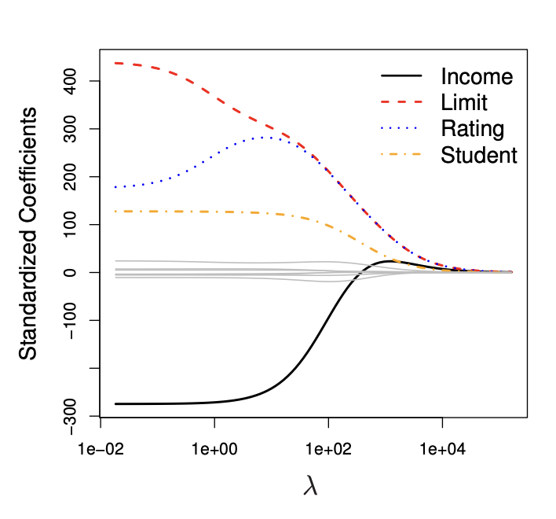

--- 
marp: true
author: 
  - name: Daniel Garcia
  - email: dgarciah@faculty.ie.edu
  - url: www.linkedin.com/in/dgarhdez
header: "ML2 - Math for ML"
size: 4:3
footer: "Daniel Garcia, dgarciah@faculty.ie.edu"
theme: default
math: katex
style: |
    img[alt~="center"] {
      display: block;
      margin: 0 auto;
    }
---
<!-- _color: "rgb(31,56,94)" -->
<!-- _header:  -->
# Machine Learning 2

## Basic mathematics for Machine Learning

---
<!-- paginate: true -->
### Relation between ML and mathematics

ML mixes mathematics, statistics, and computer science to solve problems.

Without at least a basic understanding of mathematics, it is difficult to understand ML.

We will cover the basic mathematics needed: Calculus and Linear Algebra.

---

## Calculus

* Breaking down the learning process
* Understanding Gradient Descent
* Understanding Regularization

---
<!-- _footer: "Source: Intro to ML (Slides)" -->
### Breaking down the Learning process

$$ \text{Learning} = \text{Representation} + \text{Evaluation} + \text{Optimization}$$ 

* Representation: choosing a set of estimators (e.g. linear regression, decision trees, neural networks, etc.) to model the data.
* Evaluation: how to distinguish good from bad estimators
* Optimization: making sure the estimator is learning and improving the evaluation metric

---

### Representation

We want to find a function ($\^{y}$) that maps the input ($x$) to the output ($y$).

It looks like we can use a linear function to model the data

$$ \^{y} = mx + n $$

where $m$ is the slope and $n$ the intercept.


---

### Evaluation (1)

Now that we have a representation ($\^{y}$) we need a way to evaluate how well it represents the data.

We can use the Mean Squared Error (MSE) to evaluate the performance of our model.

$$ MSE = \frac{1}{n} \sum_{i=1}^{n} (y_i - \^{y}_i)^2 $$
$$ MSE = \frac{1}{n} \sum_{i=1}^{n} (y_i - mx_i - n)^2 $$

where $n$ is the number of samples, $y_i$ is the true value and $\^{y}_i$ is the predicted value.

--- 

### Evaluation (2)

Breaking down the formula, we can see that the MSE is the average of the squared differences between the true value ($y_i$) and the predicted value ($\^{y}_i$).


---

### Optimization

We have a representation, an evaluation metric, and now we need to optimize the model to improve the evaluation metric:

* We can do that by changing $m$ and $n$ to minimize the MSE.
$$ (\downarrow MSE) = \frac{1}{n} \sum_{i=1}^{n} (y_i - (\updownarrow m)x_i - (\updownarrow n))^2 $$


There are many ways to do that, but we will use the Gradient Descent algorithm. The underlying idea is to update the parameters ($m$ and $n$) in the direction in which the MSE decreases the most.

---

## Understanding Gradient Descent

<!-- _footer: "More on GD: https://towardsdatascience.com/understanding-the-mathematics-behind-gradient-descent-dde5dc9be06e
" -->

---

### Gradient Descent (1)

In the most basic form, we can see that the MSE looks like a parabola. In order to minimize MSE, we need the set of parameters that take us to the bottom of the parabola.


 

---

### Gradient Descent (2)

To achieve this, we can take steps across the parabola, and after each step we can check if the gradient has decreased (the slope of the parabola).

We can control the direction and the length of the step. The length of the step is called Learning Rate (LR).

  

---

### Gradient Descent (3)

The choice of our LR is very important:

* If it's too small, it's gonna take forever to minimize (good performance, computationally expensive)
* If it's too big it will jump around and might never find the minimum (poor performance, computationally cheap)


---

### Gradient Descent (4)

* After every step it'll check if the gradient has decreased, until reaching a minimum.
  * This technique will find **a local minimum**, not necessarily the **global minimum** (think of an egg box)
* In general, the implementations of GD will stop after a certain number of iterations (epochs) or when the MSE stops improving.
* There are other optimization approaches like Stochastic Gradient Descent (SGD) or Adam

---

### After optimizing

We will know the parameters that will make the representation achieve a good evaluation, via optimization.

At this point we will have a trained model, and it's on us to make sure that it will generalize well when facing unseen data, to avoid poor performance:

* Overfitting happens when the error is super minimized in the training data, but when checking the error in real life's data it's not so minimized.
* Underfitting happens when the error is not minimized in the training data

---

## Understanding Regularization

---

### What is regularization

* Regularization is a technique used to avoid overfitting by penalizing the loss function (MSE in our examples) and reduce the complexity of the model.
* There are two main types of regularization: L1 and L2
  * Both are used to reduce the magnitude of the coefficients ($\beta_j$) from the linear regression model:
$$ \^{y} = \beta_0 + \beta_1 x_1 + \beta_2 x_2 + ... + \beta_p x_p $$
* This approach is also used to perform feature selection, in an embedded way at the training stage.

---

### L2 regularization - Ridge Regression

* L2 regularization adds a penalty term to the loss function that is proportional to the square of the magnitude of coefficients.

$$ L2 = \frac{1}{n} \sum_{i=1}^{n} (y_i - \^{y}_i)^2 + \lambda \sum_{j=1}^{p} \beta_j^2 $$

* The $\lambda$ (lambda) hyperparameter controls the amount of regularization to apply.
$$ \lambda = 0 \rightarrow \text{no regularization} $$
$$ \lambda = \infty \rightarrow \text{all coefficients are 0} $$

---

### Ridge vs. linear regression

* It reduces the variance (black) of the model, while increasing the bias (green) of the model, but it's a good trade-off in the sweet spot, reducing the overall MSE (red)


<!-- _footer: "Source: https://www.statlearning.com/" -->

---

### Ridge regression example

As $\lambda$ increases the coefficients for the different features are reduced, but not all the way to 0.



<!-- _footer: "Source: https://www.statlearning.com/" -->

---

### L1 regularization - Lasso Regression

* L1 regularization adds a penalty term to the loss function that is proportional to the absolute value of the magnitude of coefficients.

$$ L1 = \frac{1}{n} \sum_{i=1}^{n} (y_i - \^{y}_i)^2 + \lambda \sum_{j=1}^{p} |\beta_j| $$

* The $\lambda$ (lambda) hyperparameter controls the amount of regularization to apply.

---

### Lasso regression example

As $\lambda$ increases the coefficients for the different features are reduced and even some of them are set to 0.


<!-- _footer: "Source: https://www.statlearning.com/" -->

---

### Ridge vs Lasso (1)

* Lasso can shrink the less important feature’s coefficient to exactly 0, while Ridge will not.

* Lasso is more robust to outliers than Ridge, because it shrinks the coefficients of the outliers less than Ridge does.

* Ridge is more robust to collinearity than Lasso, because it shrinks the coefficients of the collinear features at the same time and proportionally, whereas Lasso tends to select one of the collinear features and give all the weight to it.

---

### Ridge vs Lasso (2)

* Lasso tends to perform better in a setting where a relatively small number of features have substantial coefficients, and the remaining features have coefficients that are very small or that equal zero

* Ridge regression will perform better when the target is a function of many features, all with coefficients of roughly equal size

---

## Linear Algebra

* Vectors
* Vector operations
* Matrices
* Matrix multiplication
* Inverse, transpose of a Matrix
* Matrix diagonalization

---

### Vectors

A vector is typically regarded as a geometric entity characterized by a magnitude and a direction

In Computer Science it's a data structure consisting of a collection of elements

* The positions in which we place the elements are called components of the vector
$$ \text{1 components: }\begin{pmatrix} u_1 \end{pmatrix} $$
$$ \text{2 components: } (u_1, u_2)$$
$$ \text{n components: } (u_1, u_2, ..., u_n)$$

---

### Addition and scalar multiplication

We can add and subtract vectors. The result is a vector.

$$ 
\vec u \pm  \vec v = \begin{bmatrix} u_1 \\ u_2 \\ u_3 \end{bmatrix} \pm \begin{bmatrix} v_1 \\ v_2 \\ v_3 \end{bmatrix} = \begin{bmatrix} u_1 \pm v_1 \\ u_2 \pm v_2 \\ u_3 \pm v_3 \end{bmatrix} 
$$

We can also multiply a vector by a scalar (a number).

$$
\alpha\vec u = \alpha \cdot \begin{bmatrix} u_1 \\ u_2 \\ u_3 \end{bmatrix} = \begin{bmatrix} \alpha u_1 \\ \alpha u_2 \\ \alpha u_3 \end{bmatrix}
$$

---

### Modulo of a vector, projection of vector onto vector

Modulo of a vector: the square root of the sum of the squares of its components.

$$
\lVert \vec u \rVert = \sqrt{\sum{u_i^2}}
$$

Projection of a vector: casting a vector that forms and angle $\theta$ with another vector

$$
\vec u_v = \vec u \cdot cos(\theta)
$$

---

### Dot product

Dot product: the sum of the products of the components of the vectors.

$$
\vec u \cdot  \vec v = \begin{bmatrix} u_1 \\ u_2 \\ u_3 \end{bmatrix} \cdot \begin{bmatrix} v_1 \\ v_2 \\ v_3 \end{bmatrix} = 
\sum{u_i \cdot v_i } = u_1v_1 + u_2v_2 + u_3v_3
$$

From this relation, we can see that the dot product is a scalar.

The relation between the dot product and the angle between two vectors is:

$$
cos \theta = \frac{ \vec u \cdot  \vec v}{\lVert \vec u \rVert \cdot \lVert \vec v \rVert}
$$

---

### Visual representation of vector operations


---

### Examples of vector operations in ML

* In a Linear Regression, the representation of the data is a dot product of the parameters and the features of the data point.

$$ \hat y_i = \vec \beta \cdot \vec x + \beta_0$$

* In SVM, the parameter to maximize is the projection of the data point on the parameters vector

* In PCA and LDA/QDA we are projecting the data points on the eigenvectors of the covariance matrix

---

### Matrices

A matrix is a rectangular array of elements, with $n$ rows and $p$ columns. Each element of the matrix is now represented by a pair of indices: the row and the column.
$$ A = \{a_{ij}\} $$

$$
\begin{bmatrix}
    a_{1, 1} & ... & a_{1, p} \\
    ... & ... & ... \\
    a_{n, 1} & ... & a_{n, p} \\
\end{bmatrix}
$$

In `pandas` the result of `df.values` is a matrix:

* Each column represents a feature ($p$ features)
* Each row represents an observation ($n$ observations)

---

### Matrix operations

We can operate with matrices in a similar way we operate with vectors.

* Addition and subtraction
* Multiplication by a scalar
* Multiplication by a matrix
* Inverse of a matrix
* Transpose of a matrix
* Diagonalization of a matrix

---

### Matrix addition, multiplication by a scalar

Matrix addition and subtraction:
$$
\begin{bmatrix}
    a_{1, 1} & ... & a_{1, p} \\
    ... & ... & ... \\
    a_{n, 1} & ... & a_{n, p} \\
\end{bmatrix} +
\begin{bmatrix}
    b_{1, 1} & ... & b_{1, p} \\
    ... & ... & ... \\
    b_{n, 1} & ... & b_{n, p} \\
\end{bmatrix} =
\begin{bmatrix}
    a_{1, 1}+b_{1, 1} & ... & a_{1, p}+b_{1, p} \\
    ... & ... & ... \\
    a_{n, 1}+b_{n, 1} & ... & a_{n, p}+b_{n, p} \\
\end{bmatrix}
$$

Multiplication by a scalar:
$$
k \cdot
\begin{bmatrix}
    a_{1, 1} & ... & a_{1, p} \\
    ... & ... & ... \\
    a_{n, 1} & ... & a_{n, p} \\
\end{bmatrix} =
\begin{bmatrix}
    k \cdot a_{1, 1} & ... & k \cdot a_{1, p} \\
    ... & ... & ... \\
    k \cdot a_{n, 1} & ... & k \cdot a_{n, p} \\
\end{bmatrix}
$$

---

### Multiplication of a matrix by a vector

Multiplication of a matrix by a vector:

$$
\begin{bmatrix}
    a_{1, 1} & ... & a_{1, p} \\
    ... & ... & ... \\
    a_{n, 1} & ... & a_{n, p} \\
\end{bmatrix}
\begin{bmatrix}
    u_1 \\
    ... \\
    u_p \\
\end{bmatrix} =
\begin{bmatrix}
    a_{1, 1}u_1 + ... + a_{1, p}u_p \\
    ... \\
    a_{n, 1}u_1 + ... + a_{n, p}u_p \\
\end{bmatrix}
$$

---

### Multiplication of two matrices

Requirement: The number of columns of the first matrix must be equal to the number of rows of the second matrix

Multiplication of two matrices: the final element ${i, j}$ is calculated as the dot product of the $i$-th row of the first matrix and the $j$-th column of the second matrix.

$$ 
\sum_{k=1}^p a_{i, k} \cdot b_{k, j}
$$

$$
\begin{bmatrix}
    a_{1, 1} & ... & a_{1, p} \\
    ... & ... & ... \\
    a_{n, 1} & ... & a_{n, p} \\
\end{bmatrix}
\begin{bmatrix}
    b_{1, 1} & ... & b_{1, q} \\
    ... & ... & ... \\
    b_{p, 1} & ... & b_{p, q} \\
\end{bmatrix} =
\begin{bmatrix}
    \sum_{k=1}^p a_{1, k} \cdot b_{k, 1} & ... & \sum_{k=1}^p a_{1, k} \cdot b_{k, q} \\
    ... & ... & ... \\
    \sum_{k=1}^p a_{n, k} \cdot b_{k, 1} & ... & \sum_{k=1}^p a_{n, k} \cdot b_{k, q} \\
\end{bmatrix}
$$

---

### Inverse of a matrix

Inverse of a matrix: a matrix $A$ is invertible if there exists a matrix $A_{inv}$ such that $A \cdot A_{inv} = A_{inv} \cdot A = I$, where $I$ is the identity matrix.

We can calculate the inverse of a matrix with:

$$
A_{inv} = adj(A) \cdot \frac{1}{det(A)}
$$

* $adj(A)$ is the adjugate matrix of $A$ and $det(A)$ is the determinant of $A$.


```python
# in python
A_inv = np.linalg.inv(A)
```

---

### Transpose of a matrix

Transpose of a matrix: the transpose of a matrix $A$ is the matrix $A^T$ obtained by interchanging the rows and columns of $A$.

$$
\begin{bmatrix}
    a_{1, 1} & ... & a_{1, p} \\
    ... & ... & ... \\
    a_{n, 1} & ... & a_{n, p} \\
\end{bmatrix}^T =
\begin{bmatrix}
    a_{1, 1} & ... & a_{n, 1} \\
    ... & ... & ... \\
    a_{1, p} & ... & a_{n, p} \\
\end{bmatrix}
$$

---

### Diagonalization of a matrix

Diagonal matrix: a aquare matrix with non-zero elements only on the diagonal

$$ 
D_{i,i} = \
\begin{bmatrix}
    d_{1, 1} & 0 & 0 \\
    0 & d_{2, 2} & 0 \\
    0 & 0 & d_{3, 3} \\
\end{bmatrix}
$$

Diagonalization of a matrix: for every matrix $A$ there exists a matrix $P$ such that $P^{-1}AP$ is diagonal.


---

### Example of matrix operations in ML

* Feedforward Neural Networks: in each layer, the output of the previous layer ($X$) is multiplied by the weights ($W$) and added to the biases ($b$). The result is passed to the activation function $f$ as the input of the next layer ($Y$).

$$
Y = f(W^T X  + b)
$$

* PCA: the covariance matrix is diagonalized to find the principal components.

---

### Take home points

* Understaing the math behind machine learning algorithms is important to understand how they work and to be able to explain the behavior of the models.
* A little bit of both Calculus and Linear Algebra goes a long way.

---
