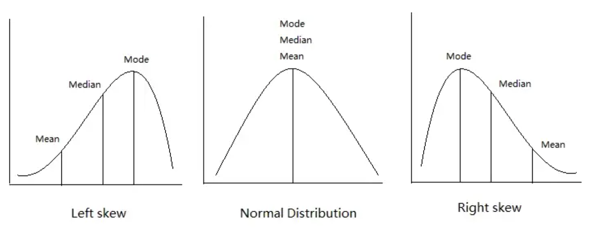

--- 
marp: true
author: 
  - name: Daniel Garcia
  - email: dgarciah@faculty.ie.edu
  - url: www.linkedin.com/in/dgarhdez
header: "ML2 - Probability and Statistics for Machine Learning"
size: 4:3
footer: "Daniel Garcia, dgarciah@faculty.ie.edu"
theme: default
math: katex
style: |
    img[alt~="center"] {
      display: block;
      margin: 0 auto;
    }
---
<!-- _color: "rgb(31,56,94)" -->
<!-- _header:  -->
# Machine Learning 2

## Probability and Statistics for Machine Learning

---
<!-- paginate: true -->
### Relation between Probability and Statistics, and Machine Learning

Probability is used to calculate the likelihood of an event occurring.

Statistics is the science of collecting, analyzing, and interpreting data.

Both of them allow to understand and improve the data and make meaningful representations of the realities we are modelling.

---

## Probability

* Definition(s)
* Intro to Set Theory
* Probability axioms and laws
* Conditional Probability
* Bayes Theorem

---

### Definition(s) of Probability

:zero: Probability is the measure of the size of a set

* Set: a collection of objects.

:one: Probability is the measure of the size of an event, relative to the size of the sample space.

* Sample space: the set of all possible outcomes of an experiment.
* Event: a subset of the sample space.

---

### Intro to Set Theory (1)

* Subset: a set that is contained in another set.
$$ A \subset B \iff \forall x \in A, x \in B $$

* Empty set $\emptyset$: a set that contains no elements.
$$ \emptyset = \{ \} $$

* Universal set $U$: the set that contains all possible elements.
$$ U = \{x: x \in S\} $$

---

### Intro to Set Theory (2)

Given two sets $A = \{a_1, ..., a_n\}$ and $B = \{b_1, ..., b_n\}$, we can define the following operations:

* Union: all the elements of $A$ and $B$.
$$ A \cup B = \{a_1, ..., a_n, b_1, ..., b_n\} $$
* Intersection: only the elements that are in both $A$ and $B$.
$$ A \cap B = \{x: x \in A,  x \in B\} $$
* Complement: all the elements that are not in $A$.
$$ A^c = \{x: x \in U, x \notin A\} $$

---

### Intro to Set Theory (3)

A probabilistic model is defined by a sample space $\Omega$ and the probability law $P$.

* Sample space $\Omega$: the set of all possible outcomes of an experiment S.
$$ \Omega = \{x: x \in S\} $$

* Probability law $P$: a function that assigns an event $A$ a nonnegative number $P(A)$.

---

### Probability axioms

**Axiom 1 (Nonnegativity)**: The probability of an event is a real number greater or equal to zero.
$$ P(A) \geq 0$$

**Axiom 2 (Additivity)**: The probability of the union of two disjoint events is the sum of the probabilities of the events.
$$ P(A \cup B) = P(A) + P(B) $$

**Axiom 3 (Normalization)**: The probability of the entire sample space is one.
$$ P(\Omega) = 1 $$

---

### Probability laws

Discrete probability law: the probability of an event is the sum of the probabilities of all the outcomes that make up the event.
$$ P(\{a_1, ..., a_n\}) = \sum_{i=1}^{n} P(a_i) = P(a_1) + ... + P(a_n)$$

Discrete uniform probability law: If the sample space consists of n possible outcomes which are equally likely, then the probability of any subset/event $A$ is:
$$ P(A) = \frac{\text{Number of elements in A}}{n} $$

---

### Properties of Probability Laws

* $A \subset B \implies P(A) \leq P(B)$
* $P(A \cup B) = P(A) + P(B) - P(A \cap B)$
* $P(A \cup B) \leq P(A) + P(B)$
* $P(A^c) = 1 - P(A)$
* $P(A \cap B) = P(B \cap A)$

---

## Conditional Probability (1)

Conditional probability is the probability of an event given that another event has already occurred. 

It helps us understanding the outcome of an experiment based on **partial information**

$$ P(A|B) = \frac{P(A \cap B)}{P(B)} $$

Given that $P(B)\neq0$. It is read as "the probability of A given B".

---

## Conditional Probability (2): 

### Total Probability Theorem

Let $A_1, ..., A_n$ be disjoint events and $P(A_i) > 0$ for all $i$. 

$$ P(B) = \sum_{i=1}^{n} P(A_i \cap B) = \sum_{i=1}^{n} P(A_i)P(B|A_i) $$

This gives us a useful tool to calculate the probability of an event using a "divide and conquer" approach, by breaking down the problem into smaller problems that we can solve.

---

## Bayes Rule

Bayes Rule is a special case of the Total Probability Theorem:

$$ P(A|B) = \frac{P(A)P(B|A)}{P(B)} $$

* $P(A|B)$: the conditional probability of A given B (Posterior probability)
* $P(A)$: the probability of A (Prior probability)
* $P(B|A)$: the conditional probability of B given A (Likelihood)
* $P(B)$: the probability of B (Marginal probability)

---

## Basic Statistics

* Estimates of location
* Estimates of dispersion
* Covariance and correlation
* Understanding distributions
* Sampling and bootstrapping

---

### Estimates of location (1)

**Mean:** the average value of a set of data.
$$ \bar{x} = \frac{1}{n} \sum_{i=1}^{n} x_i $$

```python
np.mean([1, 2, 3, 4, 5])
>> 3.0
```

**Median:** the middle value of a ordered set of data. It is the value that divides the data into two equal parts of 50% each.

```python
np.median([1, 2, 3, 4, 5])
>> 3.0
```

---

### Estimates of location (2)

**Mode:** the most frequent value of a set of data.

```python
from scipy import stats
stats.mode([1, 1, 2, 3])
>> ModeResult(mode=array([1]), count=array([2]))
```

Depending on the distribution of the data, the mean, median, and mode can be very different.



<!-- _footer: "Source: https://medium.com/@nhan.tran/mean-median-an-mode-in-statistics-3359d3774b0b" -->

---

### Estimates of dispersion (1)

* Range: the difference between the maximum and minimum values of a set of data.

* Variance: the average squared deviation from the mean.
$$ \sigma^2 = \frac{1}{n} \sum_{i=1}^{n} (x_i - \bar{x})^2 $$

* Standard deviation: the square root of the variance.
$$ \sigma = \sqrt{\frac{1}{n} \sum_{i=1}^{n} (x_i - \bar{x})^2} $$

---

### Estimates of dispersion (2)

**Quartiles:** the values that divide the data into four equal parts of 25% each.

```python
np.percentile([1, 2, 3, 4, 5], [25, 50, 75])
>> array([2., 3., 4.])
```

**Percentiles:** The value such that P percent of the values take on this value or less and (100–P) percent take on this value or more.

* If P = 50, the value is the median.
* If normalized, the value is the quantile.

```python
np.percentile([1, 2, 3, 4, 5], 50)
>> 3.0
```

---

### Estimates of dispersion (3)

* Interquartile range: the difference between the 75th and 25th percentiles.
$$ IQR = Q_3 - Q_1 $$

* Coefficient of variation: the ratio between the standard deviation and the mean.
$$ CV = \frac{\sigma}{\bar{x}} $$

---

### Estimates of dispersion (4)

* Skewness: a measure of the asymmetry of a distribution.
$$ S = \frac{E[(X - \mu)^3]}{\sigma^3} $$

* Kurtosis: a measure of the "peakedness" of a distribution.
$$ K = \frac{E[(X - \mu)^4]}{\sigma^4} $$

---

### Covariance and correlation

* Covariance: a measure of the linear relationship between two variables.
$$ Cov(X, Y) = \frac{1}{n} \sum_{i=1}^{n} (x_i - \bar{x})(y_i - \bar{y}) $$

* Correlation: a normalized version of the covariance.
$$ Corr(X, Y) = \frac{Cov(X, Y)}{\sigma_x \sigma_y} = \frac{\frac{1}{n} \sum_{i=1}^{n} (x_i - \bar{x})(y_i - \bar{y})}{\sqrt{\frac{1}{n} \sum_{i=1}^{n} (x_i - \bar{x})^2} \sqrt{\frac{1}{n} \sum_{i=1}^{n} (y_i - \bar{y})^2}} $$

---

### Understanding distributions

With the previous concepts, we have calculated metrics that describe the data. However, in order to fully understand the data, we need to understand the distribution of the data. 

A very intuitive way to do this is to use a histogram.

A histogram is a graphical representation of the distribution of data. It is a bar graph that shows the frequency of each value in a set of data.

---

### Histograms

We can use histograms to understand the distribution of the data.

* We can see how symmetric/skewed the data is
* Alongside the mean, median, and mode, we can see how the data is distributed


---

### Boxplots

Boxplots are another way to visualize the distribution of the data. They provide information about the median, quartiles.

Also, upon selecting a threshold, we can see the outliers 
$$ outlier = \begin{cases} x < Q_1 - 1.5\cdot IQR \\ x > Q_3 + 1.5\cdot IQR \end{cases} $$


---

### Sampling and bootstrapping

* Sampling: taking a subset of a population
* Bootstrapping: a method for estimating statistics on a population by sampling with replacement
  * Bootstrapping is used in many machine learning algorithms (Random Forest)
  * We can train an independent estimator on each sample and then average the results

---
