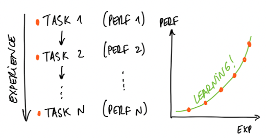
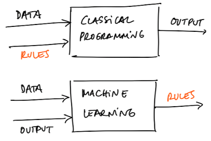
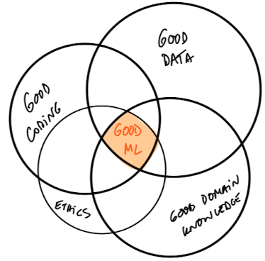
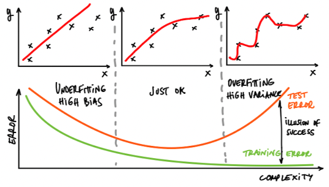
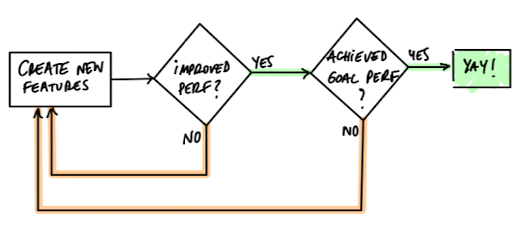
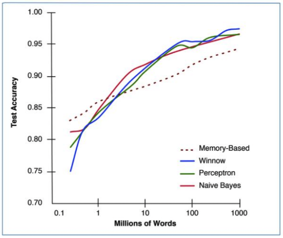

--- 
marp: true
paginate: true
author: 
  - name: Daniel Garcia
  - email: dgarciah@faculty.ie.edu
  - url: www.linkedin.com/in/dgarhdez
header: "ML2 - Intro to ML"
size: 4:3
footer: "Daniel Garcia, dgarciah@faculty.ie.edu"
theme: default
---
<!-- _class: invert -->
# Machine Learning 2

## Intro to ML

---
<!-- paginate: true -->
### About Machine Learning

*Machine Learning is a field of Computer Science that gives computers the ability to learn without being explicitly programmed.*

:man: Arthur Samuel, 1959

---

### More about Machine Learning

*A computer program learns from experience E with respect to some task T and some performance measure P, if its performance on T, as measured by P, improves with experience E.*
:man: Tom Mitchell, 1997

---

### Difference between ML and Classical Programming

* Classical Programming: we provide the rules and data and receive the output
* Machine Learning: we provide the data and desired output and receive the rules

---

### What's needed for good ML?

Good ML systems = Good coding + Good data + Good domain knowledge + Ethics

---

### Learning = Representation + Evaluation + Optimization

* Representation: choosing a set of estimators (e.g. linear regression, decision trees, neural networks, etc.)
* Evaluation: how to distinguish good from bad estimators
* Optimization: making sure the estimator is learning and improving the evaluation metric

---

### Examples on Representation, Evaluation and Optimization

* Representation: linear regression, decision trees, SVM, neural networks, etc.
* Evaluation: RMSE, MAE, MAPE, accuracy, precision, recall, F1, AUC, etc.
* Optimization: least squares, gradient descent, etc.

---
<!-- _class: lead -->
### Representation

---

### Evaluation

---

<!-- class: lead -->
### Optimization

---

### What counts is generalization

* The goal of ML is to build a model that can generalize to new data, not to memorize the training data.
  * **Achieving a high score in the training set is an illusion of success.**

* How to make sure your model generalizes well:
  * Split the data into training and test sets
  * Use cross-validation
  * Use regularization
  * ...

---

### Underfitting and Overfitting (1/3)

The usual causes for an underperforming ML model.

* **Underfitting**: the model is too simple to capture the underlying structure of the data.
  * You didn't study enough for the exam --> **you failed**

* **Overfitting**: the model is too complex and captures the noise in the data.
  * You learned all the exercises by heart but the exam was different --> **you failed**

---

### Underfitting and Overfitting (2/3)

* Detecting underfitting and overfitting can be tricky, but there are some clues.

* We can use learning curves to detect underfitting and overfitting.
  * This is a plot of the model's performance on the training set and the validation set as a function of complexity.

---

### Underfitting and Overfitting (3/3)

---

### Bias and variance

* **Bias**: the difference between the average prediction of our model and the correct value which we are trying to predict.
  * High bias can be caused by a model that is not powerful enough.

* **Variance**: the variability of model prediction for a given data point or a value which tells us spread of our data.
  * High variance can be caused by a model that is too complex or has too many parameters relative to the amount of data.

---

### Not always a more complex model is better

Depending of the reality we want to represent, a more complex model can be worse than a simpler one.

Starting from a simple model and adding complexity is a good strategy, in general.

Throwing more data at a complex model, in general, will not help if the model is too complex for the reality we want to represent.

---

### Curse of dimensionality (1/2)

* The curse of dimensionality is the phenomenon that, as the number of dimensions grows, the volume of the hypercube grows exponentially, while the number of samples needed to fill it grows linearly

* It's a problem in machine learning because as the number of features grows, the amount of data needed to train a model grows exponentially and the meaningful data becomes sparse.

---

### Curse of dimensionality (2/2)

* Many algorithms that work just fine in low dimensions (few features) become useless when the number of features is very high.

* There's an effect called "blessing of non-uniformity" that partly compensated de CoD.
  * Since the data is sparce, sometimes the data is concentrated in certain regions of the feature space and therefore we can get good results with a small amount of data.

---

### Feature engineering (1/2)

Feature engineering is the processs of extracting meaningful information from the raw data.

* Converting categorical variables to numerical variables and vice versa
* Using deltas between timestamps instead of timestamps
* Extracting certain words from a piece of text

In general, having more and better data is better than having a more complex model.

* That's why many companies share their models and architectures, but not their data.

--- 

### Feature engineering (2/2)

This process is iterative:

---

### More data is better than more complex models

*It's not who has the best model, it's who has the most data.*

:man: Banko and Brill, 2001

---

### But data alone is not enough

Data is not enough, you need to know how to use it.

* You can have the best data in the world, but if you don't know how to use it, you won't get good results.

It's the practice and domain knowledge that makes the difference.

* It's not the same approach to predict prices of stocks than to classify images.

And of course, GIGO (garbage in, garbage out).

---

### Learn many models, not just one

* It's not enough to learn one model, you need to learn many models and compare them.
* No model is the best for all problems
* In general, a combination of models is better than a single model (ensemble methods)

---

### Take home points

* Be aware of underfitting and overfitting
* Use Feature engineering to improve your data
* More complex models are not always better
* More data is better than more complex models
* Combine good data with expertise
* Ensemble your models