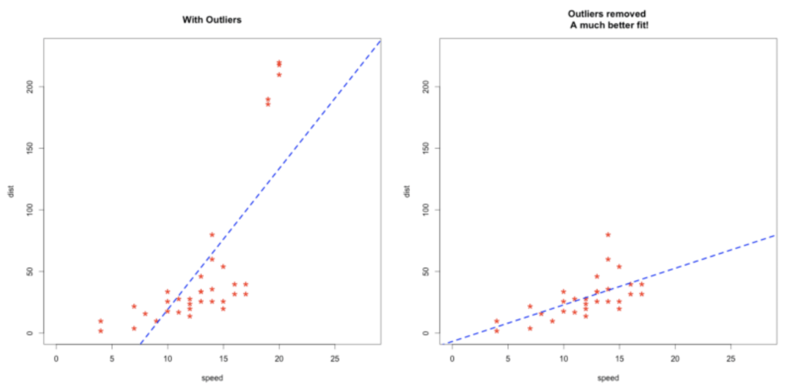
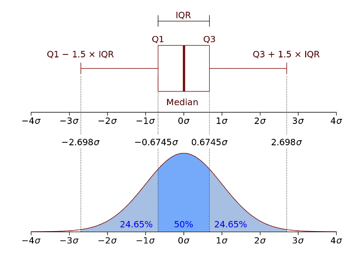
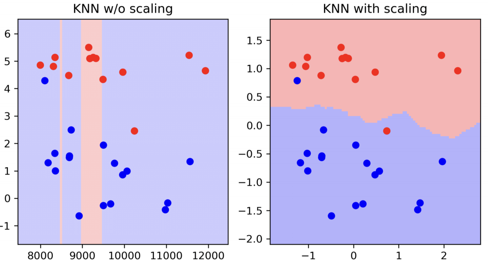
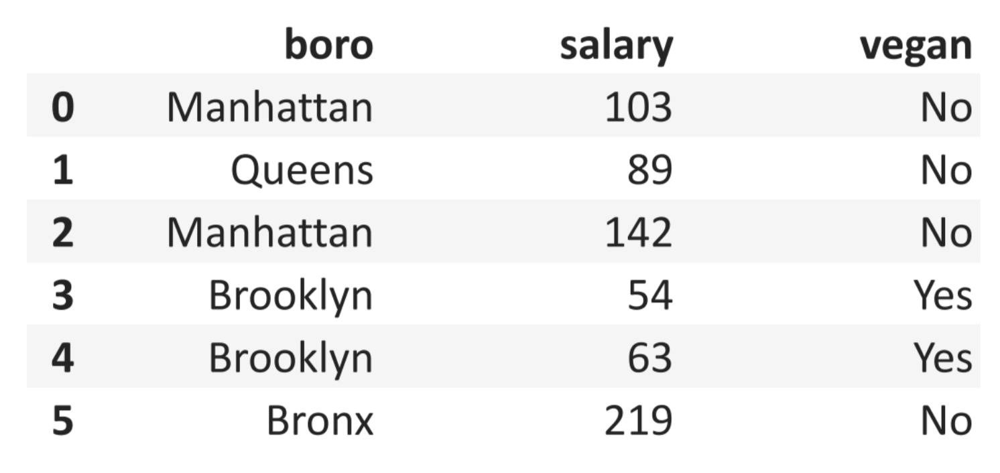
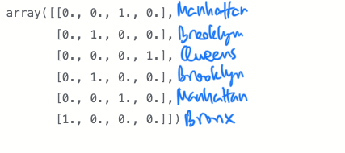
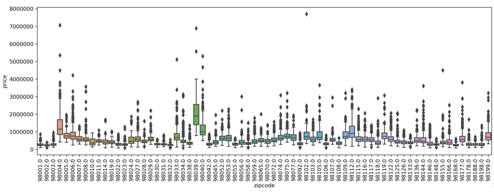

--- 
marp: true
author: 
  - name: Daniel Garcia
  - email: dgarciah@faculty.ie.edu
  - url: www.linkedin.com/in/dgarhdez
header: "ML2 - Data Cleaning"
size: 4:3
footer: "Daniel Garcia, dgarciah@faculty.ie.edu"
theme: default
---
<!-- _class: invert -->
# Machine Learning 2

## Data Cleaning

---
<!-- paginate: true -->
### About Data cleaning

*90% of data science is wrangling data, the other 10% is complaining about wrangling data*

:woman: [@evelgab](https://twitter.com/evelgab)

---

### The ML pipeline: rom raw data to deployed model

* :question:
* **Data cleaning** :hand: 
* Data exploration
* Feature engineering
* Model selection
* Model training
* Model evaluation
* Model deployment

---

### Data cleaning

:broom: Data cleaning is the process of fixing or removing incorrect, corrupted, incorrectly formatted, duplicate, or incomplete data within a dataset.

We can't just throw the raw data to our ML model, in general we need to clean it first.

This stage is crucial for the success of our model.

--- 

### What can be done to clean our data?

* Dealing with outliers
* Remove duplicates
* Remove/fill missing values
* Scale the data
* Encode categorical variables
* Dealing with skewness
...

---

### Outliers

Outliers are data points that are distant from other observations.

The presence of outliers is not wrong *per se* but it can affect the performance of our model.

* Some models are sensitive to outliers
* Outliers can be a sign of a problem in the data collection process

We need to know what will be considered an outlier and whether to keep them or not.

---
<!-- _footer: "Source: http://r-statistics.co/Outlier-Treatment-With-R.html" -->
### Effect of outliers on regression models

Outliers can make our model prone to learning from extreme behaviors

<style>
  img[alt~="center"] {
    display: block;
    margin: 0 auto;
  }
</style>


---

### Keeping or removing outliers

Keep the outliers if they're meaningful

* If we're trying to find anomalies, outliers are important

Remove the outliers if they're not meaningful

* If we're trying to predict the average behavior, outliers are not important

---

### Removing outliers using the Z-score

Z-Score: how many standard deviations is our observation above/below the mean value of the whole variable.

Given the mean ($\mu$) and standard deviation ($\sigma$), the Z-score is calculated as:
$$ z_i = \frac{x_i - \mu}{\sigma} $$

We can define a threshold after which we consider an observation an outlier, e.g. 4 standard deviations above/beyond the mean.

---

### Removing outliers using the IQR

The interquartile range (IQR) is the difference between the 75th and 25th percentiles.

$$ IQR = P75 - P25 $$

We can use this IQR to define a threshold after which we consider an observation an outlier, e.g. 1.5 times the IQR.

---
<!-- _footer: "Source: https://ca.wikipedia.org/wiki/Amplitud_interquart%C3%ADlica" -->
### Visualizing Z-Score and IQR

<style>
  img[alt~="center"] {
    display: block;
    margin: 0 auto;
  }
</style>


---
<!-- _footer: "Source: https://pandas.pydata.org/docs/reference/api/pandas.DataFrame.duplicated.html" -->
### Duplicates in our data

Duplicated data can be a problem for our model because we are training it with the same data multiple times.

We can check for duplicates using the `duplicated()` method from `pandas`:
<br/>
```python
# keeping the last duplicates in certain columns
df.duplicated(
  subset=[column1, column2, ...],
  keep="last"
)
```

---
<!-- _footer: "Source: https://pandas.pydata.org/docs/reference/api/pandas.DataFrame.drop_duplicates.html" -->
### Removing duplicates

If we want to remove the duplicates, we can use the `drop_duplicates()` method from `pandas`:
<br/>
```python
# removing the rows with duplicates in certain columns
df.drop_duplicates(
  subset=[column1, column2, ...],
  keep="last"
)
```

---

### Missing values

Missing values are incompatible with most ML models, so we need to deal with them.

They can be caused by:

* Missing data
* Data generation problems
* Data collection problems

In `python` these values are represented as `None`.
In `pandas`, these values are represented as `NaN` (Not a Number) or `NaT` (Not a Time)

---
<!-- _footer: "Source: https://hushuli.github.io/Metabox-Blog.github.io/posts/2018-11-08-missing-value/fig1.jpg" -->

### Types of missing values

* **Missing completely at random (MCAR)**: The probability of being missing is the same for all cases.
* **Missing at random (MAR)**: The probability of being missing is the same only within groups defined by the observed data
* **Missing not at random (MNAR)**: The probability of being missing varies.

<style>
  img[alt~="center"] {
    display: block;
    margin: 0 auto;
  }
</style>


---
<!-- _footer: "Source: https://argoshare.is.ed.ac.uk/healthyr_book/chap11-h1.html" -->
### What to do with each type of missing values?

* **MCAR**: 
  * Remove the rows with missing values
  * Fill them with the mean/median/mode of the variable.
  * Interpolate if the variable is a time series
  * Train a model to predict the missing values

* **MNAR** / **MAR**: 
  * Impute the missing values using a model trained to predict the missing values
  * Train a model to predict the missing values

---

### Scaling the data

Having different scales for our features can affect the performance of our model, especially if we're using distance-based models.

* Feature 1: -1 - 6
* Feature 2: 8k - 12k

<style>
  img[alt~="center"] {
    display: block;
    margin: 0 auto;
  }
</style>



---

### Effect of scaling on distance-based models

Since the distance between the points is calculated using the Euclidean distance, the scale of the features will affect the distance.
<br>
$$ d = \sqrt{(x_1 - x_2)^2 + (y_1 - y_2)^2} $$
$$ x >> y \implies d \approx x $$
<br>
Examples of distance based algorithms: KNN, Linear Regression, Logistic Regression, SVM, etc.

---
<!-- _footer: "Source: https://scikit-learn.org/stable/auto_examples/preprocessing/plot_all_scaling.html#sphx-glr-auto-examples-preprocessing-plot-all-scaling-py" -->
### Scaling the data with `sklearn` (1/2)

`sklearn` contains several methods for scaling the data.

* [`StandardScaler`](https://scikit-learn.org/stable/modules/generated/sklearn.preprocessing.StandardScaler.html): removes the mean and scaling to unit variance (Z-score)
$$ x_{scaled} = \frac{x - \mu}{\sigma} $$
* [`MinMaxScaler`](https://scikit-learn.org/stable/modules/generated/sklearn.preprocessing.MinMaxScaler.html#sklearn.preprocessing.MinMaxScaler): scales and translates each feature individually such that it is in the given range on the training set
$$ x_{scaled} = \frac{x - x_{min}}{x_{max} - x_{min}} $$


---
<!-- _footer: "Source: https://scikit-learn.org/stable/auto_examples/preprocessing/plot_all_scaling.html#sphx-glr-auto-examples-preprocessing-plot-all-scaling-py" -->
### Scaling the data with `sklearn` (2/2)

* [`RobustScaler`](https://scikit-learn.org/stable/modules/generated/sklearn.preprocessing.RobustScaler.html#sklearn.preprocessing.RobustScaler): removes the median and scales the data according to the quantile range (good for outliers)

* [`PowerTransformer`](https://scikit-learn.org/stable/modules/generated/sklearn.preprocessing.PowerTransformer.html#sklearn.preprocessing.PowerTransformer): applies a power transformation to each feature to make the data more Gaussian-like

* [And many more...](https://scikit-learn.org/stable/modules/classes.html#module-sklearn.preprocessing)

[More info on scaling, from `sklearn`](https://scikit-learn.org/stable/modules/preprocessing.html#standardizat)

---

### Dealing with categorical variables

Most ML algorithms can't deal with categorical variables, when they come as strings. We need to encode this categories as numbers

* Sex: male/female -> 0/1
* Color: red/blue/green -> 0/1/2
* Category: SPAM/Not SPAM -> 0/1

Some algorithms can deal with categorical variables:

* Tree-based algorithms
* Some Naive Bayes algorithms

---

### Encoding categorical variables with `sklearn`

`sklearn` contains several methods for encoding categorical variables.

* [`OrdinalEncoder`](https://scikit-learn.org/stable/modules/generated/sklearn.preprocessing.OrdinalEncoder.html#sklearn.preprocessing.OrdinalEncoder): encodes the labels with an ordinal representation
* [`OneHotEncoder`](https://scikit-learn.org/stable/modules/generated/sklearn.preprocessing.OneHotEncoder.html#sklearn.preprocessing.OneHotEncoder): encodes the labels with a one-hot representation
* [`TargetEncoder`](https://contrib.scikit-learn.org/category_encoders/targetencoder.html): encodes the labels with the mean of the target for each value of the feature

* [`LabelEncoder`](https://scikit-learn.org/stable/modules/generated/sklearn.preprocessing.LabelEncoder.html#sklearn.preprocessing.LabelEncoder): encodes the labels for `y` with value between `0` and `n_classes - 1`

---

### Dataset to encode

<style>
  img[alt~="center"] {
    display: block;
    margin: 0 auto;
  }
</style>



---

### `OrdinalEncoder`

```python
df["boro_ordinal"] = OrdinalEncoder().fit_transform(df[["boro"]])
```

<style>
  img[alt~="center"] {
    display: block;
    margin: 0 auto;
  }
</style>


---

### `OneHotEncoder`

```python
import pandas as pd
from sklearn.preprocessing import OneHotEncoder

df = pd.DataFrame({
    "boro": ["Manhattan", "Brooklyn", "Queens", "Brooklyn", "Manhattan", "Bronx"]
})

ohe = OneHotEncoder(handle_unknown='ignore')
enc = ohe.fit(df)
enc.transform(df).toarray()
```

<style>
  img[alt~="center"] {
    display: block;
    margin: 0 auto;
  }
</style>



--- 

### `TargetEncoder` (1/2)

For features with LOTS of categories, this can be a good option, like the zip code in the picture. 

<style>
  img[alt~="center"] {
    display: block;
    margin: 0 auto;
  }
</style>



---

### `TargetEncoder` (2/2)

```python
